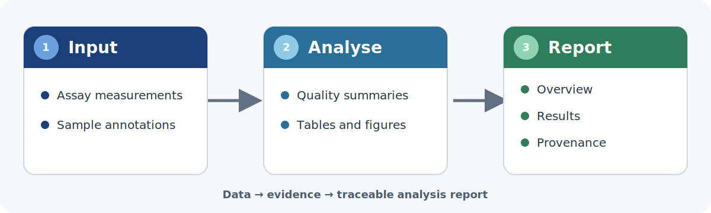

---
params:
  reportTitle: "Analysis"
title: "`r params$reportTitle`"
---

```{r setup}
#| include: false
library(ggplot2)
library(DT)
library(plotly)

generated_at <- format(Sys.time(), "%Y-%m-%d %H:%M:%S %Z")
report_package_version <- as.character(
  utils::packageVersion("fgczQuartoTemplate")
)
```

::: {.panel-tabset}

# Overview

This worked example shows how an FGCZ analysis report turns compact input data
into searchable tables and figures, then packages the results in a navigable,
self-contained HTML report. Replace the illustrative content with the purpose,
inputs, and analysis goal of the report you are authoring.

::::: {.fig-row}

:::: {.fig-main}

```{r overview-visual-abstract}
#| fig-cap: >-
#|   Visual abstract of the FGCZ reporting workflow. Compact assay inputs feed
#|   an analysis that produces quality summaries, tables, and figures, which
#|   are organized into a searchable report with explicit provenance.
#| fig-alt: >-
#|   Three connected cards labelled Input, Analyse, and Report. The Input card
#|   lists assay data and sample annotations, Analyse lists quality summaries,
#|   tables, and figures, and Report lists overview, results, and provenance.
#| out-width: "100%"

```

::::

:::: {.fig-side}

## At a glance

```{r overview-summary}
knitr::kable(
  data.frame(
    Summary = c("Input", "Scale", "Outputs", "Goal"),
    Value = c(
      "Built-in iris and mtcars data",
      paste(nrow(iris), "flowers and", nrow(mtcars), "cars"),
      "Tables, static and interactive figures, and nested tabs",
      "A compact, searchable, self-contained analysis report"
    ),
    check.names = FALSE
  ),
  caption = "High-level summary of the example report."
)
```

::::

:::::

# Section callout

<!-- PATTERN 1 — section-level callout: a full-width note that frames or
     caveats the WHOLE sub-tab (methods summary, data source, scope). Just a
     plain ::: callout (3 colons), no columns. -->

::: {.callout-note}
## About this section

Use a full-width callout when the note applies to *everything* in the sub-tab
rather than one figure. Swap `note` for `tip` / `warning` / `important` to
change the colour and icon; add `collapse="true"` to fold it shut by default.
:::

Main content of the tab then runs full-width underneath.

```{r first-dt-table}
DT::datatable(
  head(iris, 10),
  caption = paste(
    "First ten rows of iris flower measurements, including sepal length,",
    "sepal width, petal length, petal width, and species."
  ),
  filter = "bottom",
  extensions = "Buttons",
  rownames = FALSE,
  class = "compact stripe",
  options = list(
    pageLength = 5,
    scrollX = TRUE,
    dom = "Blfrtip",
    buttons = c("csv", "excel")
  )
)
```

# Annotated figure

<!-- PATTERN 2 — OPTIONAL plot + side callout (flush, same height).
     RULE: every figure carries a native #| fig-cap caption (below the plot) —
     that alone is the default figure style and obeys the yaml out.width (see
     the Nested tab for a plain example).
     EXTRA (opt-in): a green callout beside the plot for annotation, stretched
     to the plot's height via .fig-row in fgcz.scss. In THIS side-by-side
     layout the plot fills its column (size set by .fig-main in fgcz.scss, not
     out.width). Keep numbers as inline R so the note can't drift from the
     figure. The callout keeps its natural height so collapse="true" works
     (it is NOT locked to the plot height); on narrow screens it drops below
     the plot. Fence colons nest: 5 = .fig-row · 4 = each side · 3 = .callout. -->

```{r second-demo}
#| include: false
demo_df   <- mtcars
demo_n    <- nrow(demo_df)
demo_mean <- round(mean(demo_df$mpg), 1)
demo_plot <- ggplot(demo_df, aes(wt, mpg)) +
  geom_point(size = 2) +
  labs(x = "Weight (1000 lbs)", y = "Fuel economy (mpg)") +
  theme_bw()
```

::::: {.fig-row}

:::: {.fig-main}

```{r second-plot}
#| fig-cap: >-
#|   Fuel economy as a function of vehicle weight in mtcars. Each point is one
#|   car; the x-axis shows weight in 1000 lbs and the y-axis shows miles per
#|   gallon.
demo_plot
```

::::

:::: {.fig-side}

::: {.callout-tip collapse="true"}
## What this shows

Each point is one of the **`r demo_n`** cars; mean fuel economy is
**`r demo_mean` mpg**, and heavier cars are clearly less efficient. This green
box is an optional annotation beside the plot — the figure's own caption sits
underneath as usual.
:::

::::

:::::

# Nested

<!-- PATTERN 3 — nested tabset (card-in-card). The inner ::: {.panel-tabset}
     uses ## sub-headings for its tabs, one level deeper than the # tabs of
     the outer set. With fgcz.scss the inner set renders as a card inside the
     outer card. Chunks call existing functions only — no template-local
     helper defs (DT::datatable for the table, ggplot2 for the figure). -->

::: {.panel-tabset}

## Table

```{r nested-table}
DT::datatable(
  head(mtcars[, 1:6], 8),
  caption = paste(
    "First eight rows of mtcars vehicle measurements, including fuel economy,",
    "cylinders, displacement, horsepower, rear axle ratio, and weight."
  ),
  filter = "bottom",
  extensions = "Buttons",
  rownames = FALSE,
  class = "compact stripe",
  options = list(
    pageLength = 5,
    scrollX = TRUE,
    dom = "Blfrtip",
    buttons = c("csv", "excel")
  )
)
```

## Figure

```{r nested-figure}
#| fig-cap: >-
#|   Fuel economy by cylinder count in mtcars. Boxplots summarize miles per
#|   gallon for cars grouped by number of cylinders.
ggplot(mtcars, aes(factor(cyl), mpg, fill = factor(cyl))) +
  geom_boxplot(show.legend = FALSE) +
  labs(x = "Cylinders", y = "Fuel economy (mpg)") +
  theme_bw()
```

:::

# Three-level

<!-- PATTERN 4 — three levels of nesting (tabset → tabset → tabset). Every
     depth renders as the IDENTICAL folder-tab card (no per-level colour; see
     fgcz.scss) — depth reads from the nested card borders alone.
     Fence colons step DOWN per level so nesting is unambiguous:
     4 colons = level-2 tabset · 3 colons = each level-3 tabset. Tabs at each
     level are just headings: ## for level 2, ### for level 3. -->

:::: {.panel-tabset}

## By dimension

::: {.panel-tabset}

### Sepal

```{r tl-sepal}
#| fig-cap: >-
#|   Sepal width as a function of sepal length in iris. Each point is one
#|   flower; colour encodes species and both axes are measured in centimetres.
ggplot(iris, aes(Sepal.Length, Sepal.Width, colour = Species)) +
  geom_point(size = 2) +
  labs(x = "Sepal length (cm)", y = "Sepal width (cm)", colour = "Species") +
  theme_bw()
```

### Petal

```{r tl-petal}
#| fig-cap: >-
#|   Petal width as a function of petal length in iris. Each point is one
#|   flower; colour encodes species and both axes are measured in centimetres.
ggplot(iris, aes(Petal.Length, Petal.Width, colour = Species)) +
  geom_point(size = 2) +
  labs(x = "Petal length (cm)", y = "Petal width (cm)", colour = "Species") +
  theme_bw()
```

:::

## Distributions

::: {.panel-tabset}

### Sepal length

```{r tl-sepal-hist}
#| fig-cap: >-
#|   Distribution of sepal length by iris species. Overlaid histograms show
#|   flower counts across 20 sepal-length bins in centimetres.
ggplot(iris, aes(Sepal.Length, fill = Species)) +
  geom_histogram(bins = 20, alpha = 0.7, position = "identity") +
  labs(x = "Sepal length (cm)", y = "Count", fill = "Species") +
  theme_bw()
```

### Petal length

```{r tl-petal-hist}
#| fig-cap: >-
#|   Distribution of petal length by iris species. Overlaid histograms show
#|   flower counts across 20 petal-length bins in centimetres.
ggplot(iris, aes(Petal.Length, fill = Species)) +
  geom_histogram(bins = 20, alpha = 0.7, position = "identity") +
  labs(x = "Petal length (cm)", y = "Count", fill = "Species") +
  theme_bw()
```

### Interactive density

```{r tl-plotly-density}
#| fig-cap: >-
#|   Interactive density of sepal length by iris species. Each curve shows the
#|   kernel density estimate for one species; hover over the Plotly chart to
#|   inspect coordinates.
density_plot <- ggplot(
  iris,
  aes(Sepal.Length, colour = Species, fill = Species)
) +
  geom_density(alpha = 0.2, linewidth = 0.8) +
  labs(
    x = "Sepal length (cm)",
    y = "Density",
    colour = "Species",
    fill = "Species"
  ) +
  theme_bw()

plotly::ggplotly(
  density_plot,
  height = 460,
  tooltip = c("x", "y", "colour")
)
```

:::

::::

# Five-level

<!-- PATTERN 5 — five levels of nesting (tabset → … → tabset), the deepest
     nesting the template demonstrates. Every depth renders as the IDENTICAL
     folder-tab card (no per-level colour; see fgcz.scss) — depth reads from the
     nested card borders alone. This top tab is level 1; each nested
     ::: {.panel-tabset} steps one level deeper.
     Fence colons step DOWN per level so nesting stays unambiguous:
     6 = level-2 tabset · 5 = level-3 · 4 = level-4 · 3 = level-5. Tab headings
     are ## (L2) · ### (L3) · #### (L4) · ##### (L5). -->

:::::: {.panel-tabset}

## Level 2 · A

```{r fl-l2a}
#| fig-cap: >-
#|   Fuel economy as a function of vehicle weight in mtcars. Each point is one
#|   car; the x-axis shows weight in 1000 lbs and the y-axis shows miles per
#|   gallon.
ggplot(mtcars, aes(wt, mpg)) +
  geom_point(size = 2, colour = "#1B4079") +
  labs(x = "Weight (1000 lbs)", y = "Fuel economy (mpg)") +
  theme_bw()
```

## Level 2 · B (go deeper)

::::: {.panel-tabset}

### Level 3 · A

```{r fl-l3a}
#| fig-cap: >-
#|   Fuel economy by cylinder count in mtcars. Boxplots summarize miles per
#|   gallon for cars grouped by number of cylinders.
ggplot(mtcars, aes(factor(cyl), mpg, fill = factor(cyl))) +
  geom_boxplot(show.legend = FALSE) +
  labs(x = "Cylinders", y = "Fuel economy (mpg)") +
  theme_bw()
```

### Level 3 · B (go deeper)

:::: {.panel-tabset}

#### Level 4 · A

```{r fl-l4a}
#| fig-cap: >-
#|   Sepal width as a function of sepal length in iris. Each point is one
#|   flower; colour encodes species and both axes are measured in centimetres.
ggplot(iris, aes(Sepal.Length, Sepal.Width, colour = Species)) +
  geom_point(size = 2) +
  labs(x = "Sepal length (cm)", y = "Sepal width (cm)", colour = "Species") +
  theme_bw()
```

#### Level 4 · B (go deeper)

::: {.panel-tabset}

##### Level 5 · A

```{r fl-l5a}
#| fig-cap: >-
#|   Distribution of petal length by iris species. Overlaid histograms show
#|   flower counts across 20 petal-length bins in centimetres.
ggplot(iris, aes(Petal.Length, fill = Species)) +
  geom_histogram(bins = 20, alpha = 0.7, position = "identity") +
  labs(x = "Petal length (cm)", y = "Count", fill = "Species") +
  theme_bw()
```

##### Level 5 · B

```{r fl-l5b}
#| fig-cap: >-
#|   Petal width as a function of petal length in iris. Each point is one
#|   flower; colour encodes species and both axes are measured in centimetres.
ggplot(iris, aes(Petal.Length, Petal.Width, colour = Species)) +
  geom_point(size = 2) +
  labs(x = "Petal length (cm)", y = "Petal width (cm)", colour = "Species") +
  theme_bw()
```

:::

::::

:::::

::::::

# Session Info

::: {.panel-tabset}

## Report provenance

```{r report-metadata-marker}
#| results: asis
cat(
  '<div id="fgcz-report-metadata" hidden',
  ' data-project-id="example-project"',
  ' data-order-id="example-order"',
  ' data-workunit-id="example-workunit"',
  ' data-generated-by="fgczQuartoTemplate"',
  sprintf(' data-generated-at="%s"></div>', generated_at)
)
```

```{r report-provenance}
knitr::kable(
  data.frame(
    Field = c(
      "Project",
      "Order",
      "Workunit",
      "Created by",
      "Creation timestamp",
      "Input data reference",
      "Analysis software",
      "Model",
      "Report package"
    ),
    Value = c(
      "Example project",
      "Example order",
      "Example workunit",
      "fgczQuartoTemplate example vignette",
      generated_at,
      "datasets::iris and datasets::mtcars (bundled with R)",
      R.version.string,
      "Not applicable (layout demonstration)",
      paste("fgczQuartoTemplate", report_package_version)
    ),
    check.names = FALSE
  ),
  caption = "Provenance for this rendered example report."
)
```

## R session info

```{r r-session-info}
sessionInfo()
```

:::

:::
